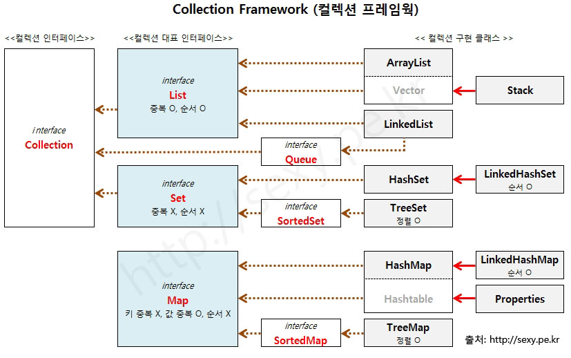

## 컬렉션 프레임 워크

**List 컬렉션**

| 메소드 | 설명 |
| :------------- | :------------- |
| boolean add(E e)       | 주어진 객체를 맨 끝에 추가   |
| void add(int index, E element) | 주어진 인덱스에 객체를 추가 |
| set(int index, E, element) | 주어진 인덱스에 저장된 객체를 주어진 객체로 바꿈 |
| boolean contains(Object o) | 주어진 객체가 저장되어 있는지 여부 |
| E get(int index) | 주어진 인ㄷ게스에 저장된 객체를 리턴 | 
| isEmpty() | 컬렉션이 비어 있는지 조사 |
| int size() | 저장되어 있는 전체 객체 수를 리턴 |
| void clear() | 저장된 모든 객체를 삭제 |
| E remove(int index) | 주어진 인덱스에 저장된 객체를 삭제 |
| boolean remove(Object o) | 주어진 객체를 삭제 |
